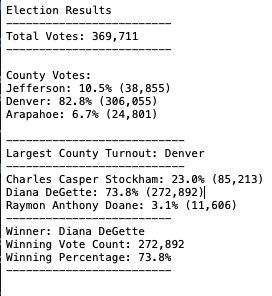

# Election Analysis - John Morrissey 

## Overview of Audit
The purpose of this audit is to verify the votes for three counties were counted accurately and the right candidate elected. Data is broken down into total votes by county and candidate. This data can later be compared to general election data to identify whether there are discrepancies. Audits are commonly used in very close elections, but for this particular dataset this is not the case. The analysed data can also be compared to past election data to identify any potential issues. 

## Election Audit Results 

For this audit the data was collected into a CSV file. Python was then used to pull the file and analyze the data. For loops, conditional statements, lists, and dictionaries were used to go through the data row by row. The total number of votes, votes by candidate, and votes by county are tabulated. The script then prints the results in a readable format and declares the winning candidate. An election results file is created for future reference. The below image displays the results of the analysis. 

* From our analysis we found a total of 369,711 votes. 

* 

